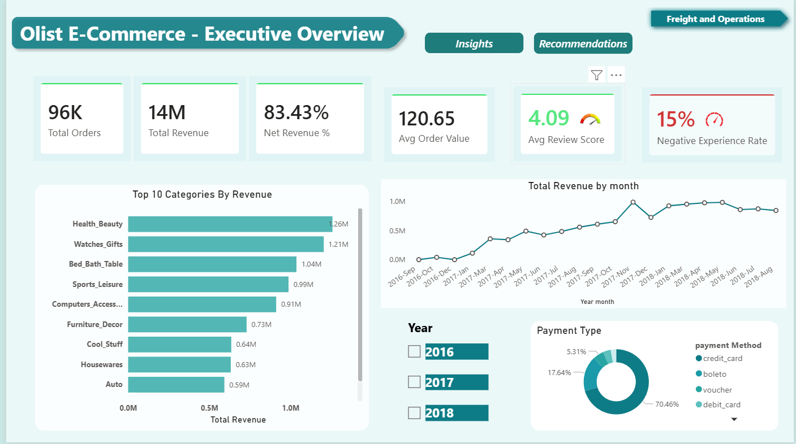
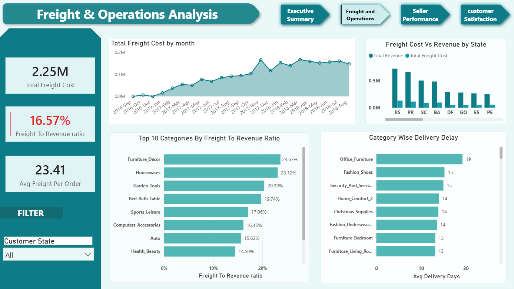
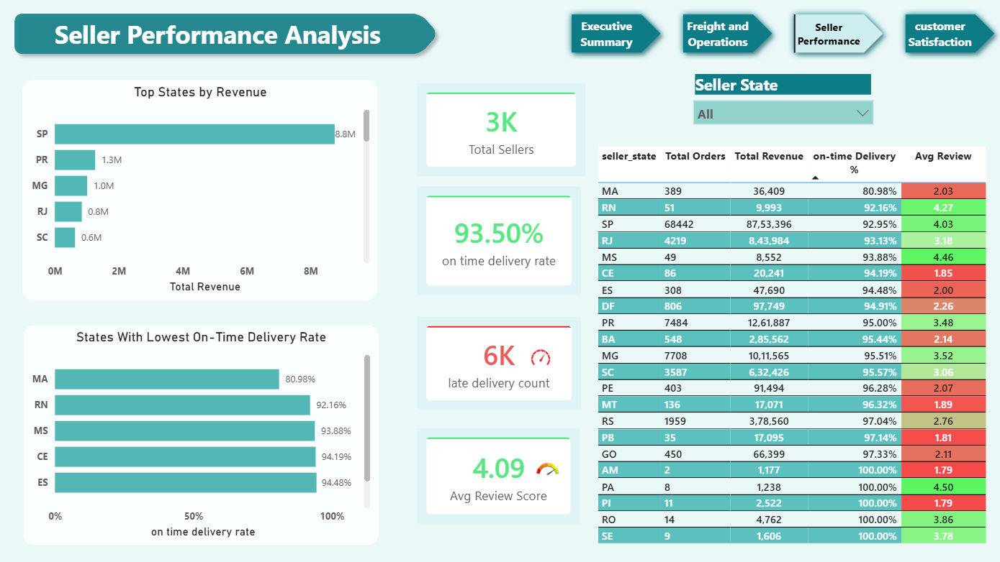
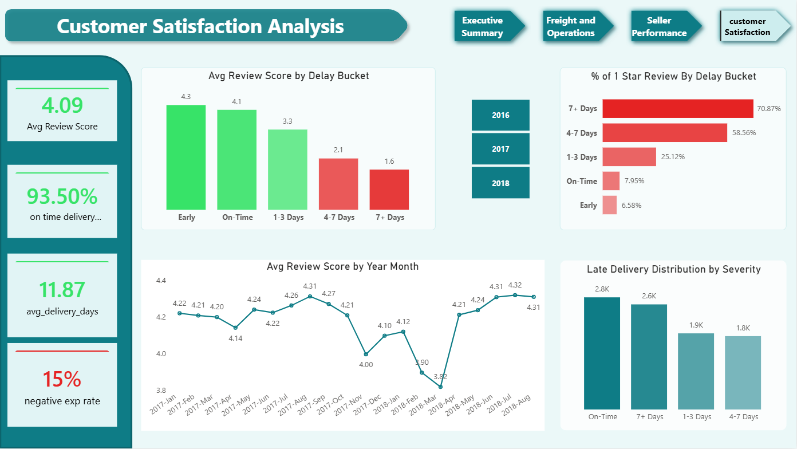

# 🛒 Olist E-Commerce Data Analytics Project

> **End-to-end data analytics project** analysing 100,000+ orders from Brazil's largest e-commerce marketplace to uncover freight inefficiencies, seller performance gaps, and customer satisfaction drivers.

---

## 📊 Dashboard Preview

> *4-page interactive Power BI dashboard — Executive Overview | Freight & Operations | Seller Performance | Customer Satisfaction*






---

##  Business Problem

Olist operates as a Brazilian e-commerce marketplace connecting sellers to customers across all states. Despite strong revenue growth from 2016–2018, the platform faces three compounding challenges:

- 📦 **Rising freight costs** consuming 16.57% of total revenue with no margin improvement
- 🚚 **Inconsistent delivery performance** across states and sellers driving operational risk
- ⭐ **15% negative customer experience rate** threatening long-term retention

---

##  Business Questions Answered

| # | Question |
|---|----------|
| Q1 | Which product categories and states have the highest freight-to-revenue ratios? |
| Q2 | Which sellers and states consistently meet delivery promises? |
| Q3 | Which product categories generate the highest net revenue after freight costs? |
| Q4 | What is the quantifiable relationship between delivery delays and customer satisfaction? |
| Q5 | How has platform revenue grown month-over-month across 2016–2018? |

---

##  Top Findings

### 1. Freight Costs Are a Structural Margin Problem
- Platform-wide freight ratio: **16.57%** of total revenue
- `home_comfort_2` category: **53.97%** freight ratio — R$54 shipping per R$100 earned
- Freight costs scaled proportionally with revenue — **margin did not improve** despite 177% growth

### 2. Northern States Are a Compounding Crisis
- States **AM, AP, AL** average **2x the national delivery time** (25 days vs 12-day average)
- Same states show highest freight-to-revenue ratios simultaneously
- One logistics investment solves both cost and delivery problems

### 3. Delivery Delay Destroys Satisfaction Exponentially

| Delay Bucket | Avg Review Score | 1-Star Rate |
|---|---|---|
| Early | 4.3 | 6.58% |
| On-Time | 4.1 | 7.95% |
| 1–3 Days Late | 3.3 | 25.12% |
| 4–7 Days Late | 2.1 | 58.56% |
| **7+ Days Late** | **1.6** | **70.87%** |

### 4. MA State Is Highest Risk
- **80.98% on-time rate** — lowest on the platform
- **2.03 average review score** — lowest on the platform
- Both metrics worst simultaneously — concentrated operational and reputational risk

### 5. Revenue Grew 177% — Margins Stagnated
- Platform revenue: **R$13.59M** across 2016–2018
- Total orders: **96,461** with average order value of **R$120.65**
- YoY growth 2017 vs 2016: **146.17%**

---

##  Recommendations

| Priority | Recommendation |
|---|---|
| 🔴 CRITICAL | Renegotiate freight carrier contracts — top categories at 35–54% ratio are unsustainable |
| 🔴 CRITICAL | Invest in northern states logistics partnerships — AM, AP, AL averaging 2x delivery time |
| 🟡 HIGH | Enforce 24-hour seller dispatch SLA — 7+ day delays drive 70.87% one-star review rate |

---

## 🗂️ Repository Structure

```
olist-ecommerce-analysis/
│
├── sql/
│   ├── 01_data_cleaning_exploration.sql
│   ├── 02_freight_cost_efficiency.sql
│   ├── 03_seller_performance.sql
│   ├── 04_category_profitability.sql
│   ├── 05_delivery_vs_satisfaction.sql
│   └── 06_revenue_trends.sql
│
├── screenshots/
│   ├── page1_executive_overview.png
│   ├── page2_freight_operations.png
│   ├── page3_seller_performance.png
│   └── page4_customer_satisfaction.png
│
├── Olist_Dashboard.pbix
├── Olist_Project_Documentation_v4_Final.docx
└── README.md
```

---

##  Tech Stack

| Tool | Usage |
|---|---|
| **SQL Server** | Data cleaning, exploration, 5 core analyses |
| **Power BI** | 4-page interactive dashboard, 13 DAX measures | 
| **DAX** | YoY measures, CALCULATE, VAR patterns, SWITCH |
| **Power Query** | Data transformation, calculated columns | 
| **Excel** | Initial data inspection, validation |

---

## 🗃️ Dataset

- **Source:** [Olist Brazilian E-Commerce Public Dataset](https://www.kaggle.com/datasets/olistbr/brazilian-ecommerce) — Kaggle
- **Period:** October 2016 – August 2018
- **Scale:** ~100,000 orders | ~3,000 sellers | ~99,000 customers | 8 relational tables
- **Tables:** `olist_orders`, `olist_order_items`, `olist_customers`, `olist_sellers`, `olist_products`, `olist_order_payments`, `olist_order_reviews`, `product_category_translation`

---

## ⚙️ SQL Techniques Used

- **CTEs** — Pre-calculate aggregations, solve alias reference limitations
- **Window Functions** — `LAG()` for month-over-month growth, `ROW_NUMBER()` for deduplication
- **Conditional Aggregation** — `COUNT(CASE WHEN ...)` for on-time delivery rates
- **CASE WHEN Bucketing** — Delay severity classification
- **NULLIF()** — Safe division to prevent divide-by-zero errors
- **Multi-table JOINs** — 3–5 table joins across all analyses
- **HAVING vs WHERE** — Post vs pre-aggregation filtering

---

## 📊 Power BI Data Model

**8 tables | 8 active relationships | 17 DAX measures**

Key relationships:
- `olist_order_items` → `olist_orders` *(Many-to-One)*
- `olist_orders` → `vw_latest_review` *(One-to-One — deduplicated review view)*
- `olist_order_items` → `olist_sellers` *(Many-to-One, Both cross-filter)*
- `olist_orders` → `calender` *(Many-to-One — fixed range 2016–2018)*

Key DAX measures:
```dax
-- Net Margin %
Net Margin % = DIVIDE([Net Revenue], [Total Revenue])

-- On Time Delivery Rate
On Time Delivery Rate = 
    DIVIDE(
        CALCULATE(COUNTROWS(olist_orders), olist_orders[delivery_delay_days] <= 0),
        [Total Orders]
    )

-- Dynamic YoY Growth
Revenue YoY Growth % = 
VAR SelectedYr = SELECTEDVALUE(calender[year])
VAR MaxYear = MAXX(ALL(calender), calender[year])
VAR CurrentValue = 
    IF(ISBLANK(SelectedYr),
        CALCULATE([Total Revenue], ALL(calender), calender[year] = MaxYear),
        CALCULATE([Total Revenue], ALL(calender), calender[year] = SelectedYr))
VAR PreviousValue = 
    IF(ISBLANK(SelectedYr),
        CALCULATE([Total Revenue], ALL(calender), calender[year] = MaxYear - 2),
        CALCULATE([Total Revenue], ALL(calender), calender[year] = SelectedYr - 1))
RETURN
    IF(ISBLANK(PreviousValue), BLANK(), 
        DIVIDE(CurrentValue - PreviousValue, PreviousValue))
```

---

## 📋 Validated KPIs

| Metric | Value |
|---|---|
| Total Orders | 96,461 |
| Total Revenue | R$ 13,591,644 |
| Net Margin % | 83.43% |
| Avg Order Value | R$ 120.65 |
| Freight to Revenue % | 16.57% |
| Avg Delivery Days | 11.87 |
| On-Time Delivery Rate | 93.50% |
| Late Delivery Count | 6,250 |
| Avg Review Score | 4.09 |
| Negative Experience Rate | 14.69% |

---

##  How to Use This Project

**To explore the SQL analysis:**
1. Download the `.sql` files from the `/sql` folder
2. Run on SQL Server with the Olist dataset loaded
3. Execute scripts in order (01 → 06)

**To explore the Power BI dashboard:**
1. [📊 Download Power BI Dashboard (.pbix)](https://drive.google.com/file/d/15_vM6hpw1om-ans9KvGkxRIK4NBjtUTE/view?usp=sharing)
2. 💡 Click "Download anyway" when prompted — file is 29MB, safe to download. Open with Power BI Desktop (free).

  ** 💡 **Note: ** Data is embedded in the .pbix.file. No SQL Server required to view the Dashboard, just Power BI Desktop (free) is enough. 
  
**Dataset download:** [Kaggle — Olist Brazilian E-Commerce](https://www.kaggle.com/datasets/olistbr/brazilian-ecommerce)

---

## 👤 About

**MBA Graduate | Junior Data Analyst**

This project demonstrates end-to-end data analytics capability - from raw data ingestion through SQL analysis, Power BI dashboard design, and business recommendation. Built independently as a portfolio project to transition into a data role.

**Skills demonstrated:** SQL Server · Power BI · DAX · Data Modelling · Business Analysis · Data Storytelling

---

*Dataset: Olist Brazilian E-Commerce Public Dataset (Kaggle) — used for educational and portfolio purposes*
